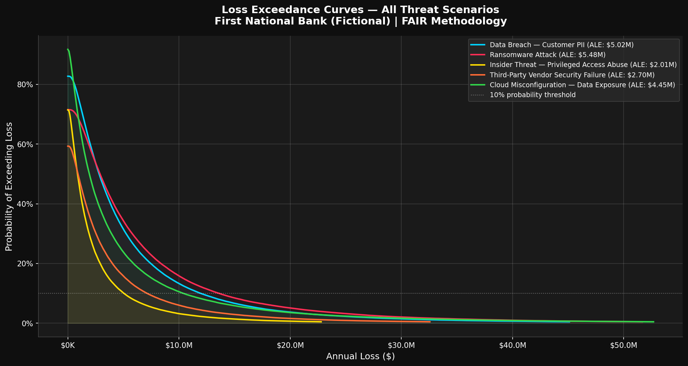

# Financial Services Cyber Risk Intelligence Platform

**Author:** Ameer Mohammad Khan  
**Background:** 3rd Year CS @ University of Toronto | Data Analyst I @ Manulife | Part-time @ Scotiabank  
**Target Role:** GRC Cybersecurity Analyst — Canadian Financial Services  
**Status:** 🔨 Week 2 Complete — Quantitative Risk Engine

---

## What This Project Is

A Python-based GRC portfolio project simulating a real cybersecurity risk 
program for a fictional Canadian financial institution. Built to demonstrate 
practical GRC engineering skills — not just framework knowledge, but working 
tools that produce real outputs.

---

## Three Modules

| Module | Description | Frameworks | Status |
|--------|-------------|------------|--------|
| **NIST CSF 2.0 Assessment** | Maturity scoring engine with gap analysis and cross-framework mapping | NIST CSF 2.0, ISO 27001, SOC 2 | ✅ Complete |
| **Quantitative Risk Engine** | Dollar-value risk modelling across 5 threat scenarios using FAIR | FAIR Methodology | ✅ Complete |
| **Vendor Risk Assessor** | OSFI-aligned questionnaire generator with risk tiering | OSFI B-10, B-13 | 📅 Week 3 |

---

## Module 1 — NIST CSF 2.0 Assessment Engine

### What it does
- Scores a fictional Canadian bank across all 6 NIST CSF 2.0 functions
- Generates a prioritised gap analysis ranked by risk score
- Maps every control to equivalent ISO 27001 and SOC 2 references
- Saves all assessment data to SQLite with full audit trail

### Sample Output
```
╭───────────┬───────┬────────────┬──────────╮
│ Function  │ Score │ Visual     │ Status   │
├───────────┼───────┼────────────┼──────────┤
│ Govern    │ 2/5   │ ██░░░      │ ⚠️  GAP  │
│ Identify  │ 2/5   │ ██░░░      │ ⚠️  GAP  │
│ Protect   │ 3/5   │ ███░░      │ ✅ OK    │
│ Detect    │ 2/5   │ ██░░░      │ ⚠️  GAP  │
│ Respond   │ 1/5   │ █░░░░      │ ⚠️  GAP  │
│ Recover   │ 3/5   │ ███░░      │ ✅ OK    │
╰───────────┴───────┴────────────┴──────────╯
Overall Maturity Score: 2.2 / 5.0
```

---

## Module 2 — Quantitative Risk Engine (FAIR)

### What it does
- Models 5 realistic threat scenarios for a Canadian financial institution
- Implements FAIR methodology using Monte Carlo simulation (100,000 runs)
- Produces Annualised Loss Expectancy (ALE) and Loss Exceedance Curves
- Calculates ROI of security controls against expected annual losses
- Stores all results in SQLite for trend analysis

### The 5 Scenarios

| Scenario | ALE (approx) | 90th Percentile | Control Cost |
|----------|-------------|-----------------|--------------|
| Data Breach — Customer PII | ~$2.1M | ~$5.2M | $350K |
| Ransomware Attack | ~$2.8M | ~$6.8M | $500K |
| Insider Threat | ~$1.2M | ~$3.1M | $280K |
| Third-Party Vendor Failure | ~$1.5M | ~$4.0M | $200K |
| Cloud Misconfiguration | ~$1.8M | ~$4.5M | $180K |

### Loss Exceedance Curve


### Why FAIR over High/Medium/Low
A board member cannot act on "ransomware risk is HIGH."  
They can act on "ransomware carries an expected annual loss of $2.8M,  
with a 10% chance of exceeding $6.8M — vs. $500K to implement controls."  
That is the business case FAIR enables.

---

## How to Run
```bash
# Clone and set up
git clone https://github.com/YOUR_USERNAME/financial-services-grc-platform.git
cd financial-services-grc-platform
python3 -m venv venv
source venv/bin/activate
pip install -r requirements.txt

# Module 1 — NIST CSF Assessment
python3 src/compliance/scoring_engine.py
python3 src/compliance/gap_analysis.py
python3 src/compliance/framework_mapper.py

# Module 2 — Quantitative Risk Engine
python3 src/risk_quantification/run_scenarios.py
python3 src/risk_quantification/loss_exceedance.py
python3 src/risk_quantification/risk_report.py
```

---

## Tech Stack
- **Python 3.13** — scoring engine, FAIR simulations, reporting
- **numpy / scipy** — Monte Carlo simulation and statistical modelling
- **matplotlib** — Loss Exceedance Curve visualisation
- **SQLite** — persistent storage with full audit trail
- **pandas / tabulate / colorama** — data handling and terminal output

---

## Repository Structure
```
financial-services-grc-platform/
├── README.md
├── requirements.txt
├── docs/
│   ├── nist_csf_cheatsheet.md
│   ├── nist_csf_gap_analysis.md
│   ├── control_framework_mapping.md
│   └── risk_assessment_methodology.md
├── src/
│   ├── compliance/
│   │   ├── scoring_engine.py
│   │   ├── gap_analysis.py
│   │   ├── framework_mapper.py
│   │   └── csf_data.py
│   ├── risk_quantification/
│   │   ├── fair_engine.py
│   │   ├── scenarios.py
│   │   ├── run_scenarios.py
│   │   ├── loss_exceedance.py
│   │   └── risk_report.py
│   └── database/
│       ├── schema.sql
│       └── db_manager.py
└── dashboards/
    ├── lec_all_scenarios.png
    └── lec_[scenario].png (x5)
```

---

## Why Financial Services?

I work as a Data Analyst at Manulife and part-time at Scotiabank. Both 
operate under OSFI regulation. I built this project to demonstrate GRC 
skills in the exact regulatory environment Canadian financial institutions 
operate in — not generic theory, but applied practice.

---

## Coming in Weeks 3–4
- **Week 3:** Streamlit vendor risk assessor aligned to OSFI B-10 and B-13
- **Week 4:** Power BI dashboards, executive PDF summary, Excel risk register