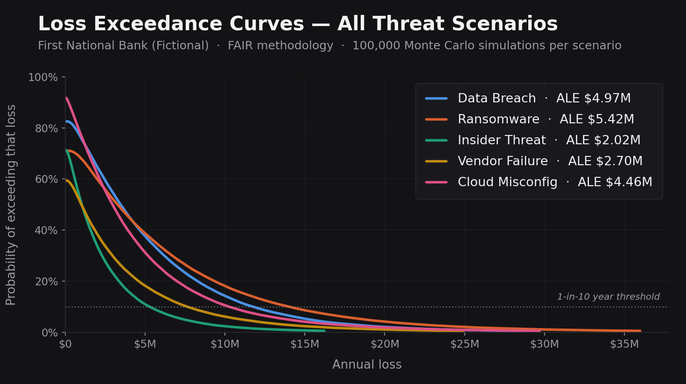
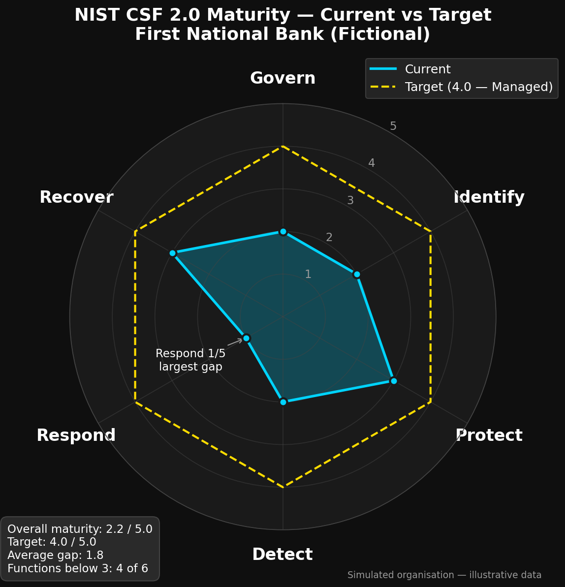
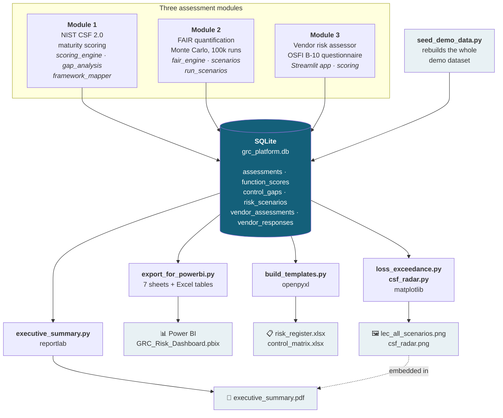

# Financial Services Cyber Risk Intelligence Platform

**A working GRC toolchain for a Canadian bank: NIST CSF 2.0 maturity scoring, FAIR risk quantification in dollars, and OSFI B-10 vendor risk assessment — one SQLite database, one Power BI dashboard, one executive briefing.**

[](https://www.python.org/downloads/)
[](https://github.com/ameerrkhann/financial-services-grc-platform/actions/workflows/tests.yml)
[](LICENSE)

**Author:** Ameer Mohammad Khan
**Background:** 4th Year CS @ University of Toronto | Data Analyst I @ Manulife | Part-time @ Scotiabank
**Target Role:** GRC Cybersecurity Analyst — Canadian Financial Services
**Status:** ✅ Complete

> **Simulated organisation.** First National Bank (Fictional) is not a real institution, and every vendor named in this project is invented. All figures are modelled, not observed.

---

## What This Project Is

A Python GRC toolchain simulating a real cybersecurity risk programme for a fictional Canadian federally regulated financial institution. It exists to demonstrate practical GRC engineering — not framework recall, but working tools that produce the artefacts a risk function actually ships: a quantified risk register, a board-ready dashboard, an executive briefing, and an auditable vendor assessment trail.

Every number in this README comes from running the code. Reproduce all of it with one command: `python3 src/database/seed_demo_data.py`.

---

<!--
HERO IMAGES — these six files are referenced below and need to be dropped into
dashboards/. Exact filenames expected:
  dashboards/powerbi_dashboard1.png    (screenshot: risk overview page)
  dashboards/powerbi_dashboard2.png    (screenshot: CSF maturity page)
  dashboards/powerbi_dashboard3.png    (screenshot: vendor risk page)
  dashboards/streamlit_vendor_app.png  (screenshot: vendor assessor in browser)
lec_all_scenarios.png and csf_radar.png are already generated by the code.
-->

| | |
|---|---|
|  |  |
|  |  |
|  |  |

---

## Architecture


```mermaid
flowchart TD
    subgraph M["Three assessment modules"]
        M1["<b>Module 1</b><br/>NIST CSF 2.0<br/>maturity scoring<br/><i>scoring_engine · gap_analysis<br/>framework_mapper</i>"]
        M2["<b>Module 2</b><br/>FAIR quantification<br/>Monte Carlo, 100k runs<br/><i>fair_engine · scenarios<br/>run_scenarios</i>"]
        M3["<b>Module 3</b><br/>Vendor risk assessor<br/>OSFI B-10 questionnaire<br/><i>Streamlit app · scoring</i>"]
    end

    SEED["<b>seed_demo_data.py</b><br/>rebuilds the whole<br/>demo dataset"]
    DB[("<b>SQLite</b><br/>grc_platform.db<br/><br/>assessments · function_scores<br/>control_gaps · risk_scenarios<br/>vendor_assessments · vendor_responses")]

    M1 --> DB
    M2 --> DB
    M3 --> DB
    SEED --> DB

    DB --> EXPORT["<b>export_for_powerbi.py</b><br/>7 sheets + Excel tables"]
    DB --> PDF["<b>executive_summary.py</b><br/>reportlab"]
    DB --> TPL["<b>build_templates.py</b><br/>openpyxl"]
    DB --> CHARTS["<b>loss_exceedance.py</b><br/><b>csf_radar.py</b><br/>matplotlib"]

    EXPORT --> PBI["📊 Power BI<br/>GRC_Risk_Dashboard.pbix"]
    PDF --> DOC["📄 executive_summary.pdf"]
    TPL --> XL["📋 risk_register.xlsx<br/>control_matrix.xlsx"]
    CHARTS --> PNG["🖼️ lec_all_scenarios.png<br/>csf_radar.png"]

    PNG -.embedded in.-> DOC

    style DB fill:#14607A,color:#fff
    style SEED fill:#E8F1F4
    style PBI fill:#E8F1F4
    style DOC fill:#E8F1F4
    style XL fill:#E8F1F4
    style PNG fill:#E8F1F4
```

---

## Three Modules

| Module | What it does | Frameworks |
|--------|--------------|------------|
| **NIST CSF 2.0 Assessment** | Maturity scoring across 6 functions, gap analysis ranked by risk score, cross-framework control mapping | NIST CSF 2.0, ISO/IEC 27001:2022, SOC 2 |
| **Quantitative Risk Engine** | Dollar-value risk across 5 threat scenarios, Monte Carlo simulation, loss exceedance curves, ROSI | FAIR |
| **Vendor Risk Assessor** | OSFI-aligned questionnaire generator, weighted scoring, automated tiering, reassessment tracking | OSFI B-10, B-13, E-21 |

---

## Module 1 — NIST CSF 2.0 Assessment Engine

Scores the bank across all six CSF 2.0 functions against a target maturity of 4, records the gaps, and ranks them into a remediation roadmap.

### Current maturity — overall 2.2 / 5.0

| Function | Current | Target | Gap | Status |
|----------|---------|--------|-----|--------|
| Govern | 2/5 | 4/5 | 2 | ⚠️ Gap |
| Identify | 2/5 | 4/5 | 2 | ⚠️ Gap |
| Protect | 3/5 | 4/5 | 1 | ✅ At defined |
| Detect | 2/5 | 4/5 | 2 | ⚠️ Gap |
| Respond | 1/5 | 4/5 | 3 | ⚠️ Gap |
| Recover | 3/5 | 4/5 | 1 | ✅ At defined |

A score below 3 is a gap: 3 means documented and consistently followed, 4 means measured and tracked with metrics.

### Remediation roadmap

Ranked by `(3 − score) × (7 − function priority)`, so a deeper gap in a more foundational function is fixed first.

```
╭─────┬────────────┬─────────┬────────────┬──────────┬─────────────────┬──────────────╮
│   # │ Function   │ Score   │ Priority   │ Effort   │ Est. Fix Time   │   Risk Score │
├─────┼────────────┼─────────┼────────────┼──────────┼─────────────────┼──────────────┤
│   1 │ Govern     │ 2/5     │ Critical   │ Low      │ 4 weeks         │            6 │
│   2 │ Identify   │ 2/5     │ Critical   │ Medium   │ 8 weeks         │            5 │
│   3 │ Respond    │ 1/5     │ High       │ Low      │ 6 weeks         │            4 │
│   4 │ Detect     │ 2/5     │ High       │ Medium   │ 10 weeks        │            3 │
╰─────┴────────────┴─────────┴────────────┴──────────┴─────────────────┴──────────────╯
```

### Identified gaps and their framework references

| Function | Priority | NIST CSF 2.0 | ISO/IEC 27001:2022 | SOC 2 |
|----------|----------|--------------|--------------------|-------|
| Govern | Critical | GV.PO-01 | A.5.1 | CC1.1 |
| Identify | Critical | ID.AM-01 | A.5.9 | CC6.1 |
| Detect | High | DE.CM-01 | A.8.15, A.8.16 | CC7.2 |
| Respond | High | RS.MA-01 | A.5.24, A.5.26 | CC7.3 |

### Cross-framework mapping

17 controls, each satisfying four frameworks at once. A sample:

| NIST CSF 2.0 | ISO/IEC 27001:2022 | SOC 2 | OSFI | What it does |
|--------------|--------------------|-------|------|--------------|
| GV.PO-01 | A.5.1 | CC1.1 | B-13 Governance and Risk Management | Cybersecurity policy |
| PR.AA-01 | A.5.15, A.8.5 | CC6.1 | B-13 Cyber Security | Identity management and MFA |
| PR.AA-05 | A.5.18 | CC6.3 | B-13 Cyber Security | Least privilege, access reviews |
| DE.CM-01 | A.8.15, A.8.16 | CC7.2 | B-13 Cyber Security | SIEM monitoring |
| RS.MA-01 | A.5.24, A.5.26 | CC7.4 | B-13 Cyber Security | Incident response plan |
| RS.CO-02 | A.6.8 | CC2.2 | Incident reporting advisory | 24-hour OSFI notification |
| RC.RP-01 | A.5.29, A.5.30 | A1.2 | E-21 | Recovery plan execution |
| GV.SC-07 | A.5.22 | CC9.2 | B-10 | Ongoing vendor monitoring |

The full table is in [`docs/control_framework_mapping.md`](docs/control_framework_mapping.md), generated by the code.

> **On CSF 2.0 accuracy.** An earlier version of this project used four CSF 1.1 identifiers that no longer exist in 2.0 — `PR.AC-01`, `RS.RP-01`, `RC.IM-01`, and `GV.OC-01` used for policy. They were verified against the CSF 2.0 Core and corrected to `PR.AA-01`, `RS.MA-01`, `ID.IM-04` (Improvement moved from Recover to **Identify** in 2.0), and `GV.PO-01`. The ISO references were likewise 2013 numbering under a 2022 label. [`docs/nist_csf_cheatsheet.md`](docs/nist_csf_cheatsheet.md) lists the traps. Two tests fail if any of them come back.

---

## Module 2 — Quantitative Risk Engine (FAIR)

### Why FAIR over High / Medium / Low

A board cannot act on "ransomware risk is HIGH." It can act on "ransomware carries an expected annual loss of $5.42M, with a 1-in-10 chance of exceeding $13.99M — against $500K a year to control it, a 713% return."

### The five scenarios

100,000 simulated years each, fixed seed per scenario so every artefact in this repo quotes the same number.

| Scenario | Loss range | Events/yr | ALE | 90th %ile | Control cost | Ctrl eff. | Residual ALE | ROSI |
|----------|-----------|-----------|-----|-----------|--------------|-----------|--------------|------|
| Ransomware Attack | $800K – $12M | 0.5–2.0 | **$5.42M** | $13.99M | $500K | 75% | $1.35M | 713% |
| Data Breach — Customer PII | $500K – $8M | 0.5–3.0 | **$4.97M** | $11.74M | $350K | 70% | $1.49M | 894% |
| Cloud Misconfiguration | $150K – $6M | 1.0–4.0 | **$4.46M** | $10.24M | $180K | 80% | $892.8K | 1884% |
| Third-Party Vendor Failure | $400K – $9M | 0.3–1.5 | **$2.70M** | $7.63M | $200K | 60% | $1.08M | 711% |
| Insider Threat | $200K – $5M | 0.5–2.0 | **$2.02M** | $5.27M | $280K | 65% | $706.0K | 368% |
| **Portfolio** | | | **$19.58M** | | **$1.51M** | | **$5.53M** | **830%** |

The full control programme costs $1.51M a year and removes $14.05M of expected annual loss — 72% of the portfolio.

**Control effectiveness is an assumption, not a measurement.** Each scenario documents a 60–80% figure in [`scenarios.py`](src/risk_quantification/scenarios.py) reflecting a mature-but-imperfect control stack. It is the number a sceptical audit committee should challenge first, and lowering it reduces ROSI proportionately.

### Tail risk

| Scenario | Median | 95th %ile | P(> $1M) | P(> $5M) |
|----------|--------|-----------|----------|----------|
| Ransomware Attack | $3.27M | $18.70M | 68% | 39% |
| Data Breach — Customer PII | $3.47M | $15.26M | 76% | 38% |
| Cloud Misconfiguration | $2.96M | $13.91M | 77% | 31% |
| Third-Party Vendor Failure | $1.01M | $11.02M | 50% | 18% |
| Insider Threat | $1.04M | $7.41M | 51% | 11% |


### How the model works

Each simulated year draws an event count `N ~ Poisson(λ)`, then draws **N independent** log-normal loss magnitudes and sums them. Loss low and high are treated as the 5th and 95th percentiles of the magnitude distribution; λ is the midpoint of the frequency range. Vectorised with `np.repeat` and `np.bincount` — no Python loop over 100,000 years.

> **This was wrong for several weeks.** The first version multiplied a single loss draw by the event count, forcing every event in a year to cost the same and inflating the 99th percentile by 22–36%. The mean was unaffected, which is why it survived review. [`notebooks/README.md`](notebooks/README.md) documents the bug, the fix, and the before/after numbers; [`notebooks/01_fair_first_attempt.py`](notebooks/01_fair_first_attempt.py) preserves the original code.

`riskquant` is **not** a dependency — it does not support Python 3.13, so the FAIR maths is implemented directly with numpy in [`fair_engine.py`](src/risk_quantification/fair_engine.py).

---

## Module 3 — Vendor Risk Assessor (OSFI B-10)

A Streamlit app that generates a questionnaire tailored to the vendor's service type, scores the responses with a weighted engine, assigns a risk tier, and writes a full audit trail to SQLite.

### Questionnaire coverage

14 universal questions plus 4 service-specific ones per vendor type — 18 questions across Cloud Provider, Payment Processor, Software / SaaS, Data Analytics / AI, and IT Infrastructure. Weight-3 questions (policy, certification, breach notification, MFA, encryption, BCP) move the score more than weight-2 ones. `N/A` is excluded from the denominator rather than scored as zero.

### Risk tiers and reassessment cycles

| Score | Tier | Reassessment | Action required |
|-------|------|--------------|-----------------|
| 0–40 | 🔴 Critical | 90 days | Do not onboard without a remediation plan. Executive approval required. |
| 41–60 | 🟠 High | 90 days | Onboard with conditions. Quarterly reassessment. |
| 61–80 | 🟡 Medium | 365 days | Standard onboarding. Annual reassessment. |
| 81–100 | 🟢 Low | 730 days | Approve for onboarding. Biennial reassessment. |

The cycle is defined once, in `RISK_TIERS[...]["reassessment_days"]`, and both `get_overdue_vendors()` and the Power BI export read it — so the cycle shown to an assessor is the cycle actually enforced.

### Demo vendor portfolio

Eight fictional vendors across all five service types:

| Vendor | Service type | Criticality | Score | Tier | Gaps | Critical | Last assessed |
|--------|-------------|-------------|-------|------|------|----------|---------------|
| Lakeshore Trust Software | Software / SaaS | High | 90 | 🟢 Low | 4 | 0 | 120d |
| NorthPeak Cloud Services | Cloud Provider | Critical | 88 | 🟢 Low | 4 | 0 | 200d |
| MapleLedger Payments | Payment Processor | Critical | 72 | 🟡 Medium | 8 | 0 | 45d |
| Cartier Ledger Systems | Software / SaaS | Medium | 72 | 🟡 Medium | 8 | 0 | 80d |
| Gastown Data Works | Data Analytics / AI | Medium | 65 | 🟡 Medium | 10 | 0 | **400d ⚠️** |
| Acadia Payment Networks | Payment Processor | High | 48 | 🟠 High | 14 | 1 | **140d ⚠️** |
| Borealis Analytics | Data Analytics / AI | High | 45 | 🟠 High | 14 | 1 | 30d |
| Rideau Infrastructure Group | IT Infrastructure | High | 34 | 🔴 Critical | 14 | 3 | **220d ⚠️** |

Portfolio average 64.2/100. Three vendors are past the reassessment window for their tier — the open item against B-10's ongoing-monitoring expectation.


### OSFI B-10 coverage

| B-10 expectation | Tool feature | Coverage |
|------------------|--------------|----------|
| Governance and accountability | Assessor and date recorded per assessment; tier reporting | ✅ Full |
| Risk-based due diligence | Weighted questionnaire, service-specific questions | ✅ Full |
| Risk and criticality assessment | Automated Critical / High / Medium / Low tiering | ✅ Full |
| Contractual provisions | Questions U03, U07, U08, U13, U14 | ✅ Full |
| Ongoing monitoring | Per-tier reassessment windows, overdue flagging | ✅ Full |
| Subcontracting / fourth party | Question U13 | ✅ Full |
| Termination and exit planning | Cloud-specific question CL03 | 🟡 Partial |
| Records and reporting | Full SQLite record per assessment and per response | ✅ Full |

Full mapping in [`docs/osfi_b10_mapping.md`](docs/osfi_b10_mapping.md).

---

## Deliverables

| Deliverable | File | Produced by |
|-------------|------|-------------|
| Power BI report | [`dashboards/GRC_Risk_Dashboard.pbix`](dashboards/GRC_Risk_Dashboard.pbix) | Built on `grc_powerbi_data.xlsx` (7 sheets, 7 Excel tables) |
| Power BI data export | [`dashboards/grc_powerbi_data.xlsx`](dashboards/grc_powerbi_data.xlsx) | `src/reporting/export_for_powerbi.py` |
| Executive briefing (PDF) | [`docs/executive_summary.pdf`](docs/executive_summary.pdf) | `src/reporting/executive_summary.py` |
| Risk register template | [`templates/risk_register.xlsx`](templates/risk_register.xlsx) | `src/reporting/build_templates.py` |
| Control matrix template | [`templates/control_matrix.xlsx`](templates/control_matrix.xlsx) | `src/reporting/build_templates.py` |
| Loss exceedance curves | [`dashboards/lec_all_scenarios.png`](dashboards/lec_all_scenarios.png) | `src/risk_quantification/loss_exceedance.py` |
| CSF maturity radar | [`dashboards/csf_radar.png`](dashboards/csf_radar.png) | `src/compliance/csf_radar.py` |
| Video walkthrough | LOOM_LINK_HERE | — |

Details of how each was produced: [`docs/week4_deliverables.md`](docs/week4_deliverables.md).

---

## How to Run

```bash
# 1. Clone and set up
git clone https://github.com/ameerrkhann/financial-services-grc-platform.git
cd financial-services-grc-platform
python3 -m venv venv
source venv/bin/activate
pip install -r requirements.txt

# 2. Build the demo dataset — start here. Rebuilds the database from scratch:
#    CSF baseline, 5 FAIR scenarios, 8 vendors.
python3 src/database/seed_demo_data.py

# 3. Generate every deliverable
python3 src/risk_quantification/loss_exceedance.py   # LEC charts
python3 src/compliance/csf_radar.py                  # CSF maturity radar
python3 src/reporting/export_for_powerbi.py          # Power BI workbook
python3 src/reporting/executive_summary.py           # executive PDF
python3 src/reporting/build_templates.py             # Excel templates

# 4. Run the tests
pytest -v

# 5. Explore interactively
python3 src/compliance/scoring_engine.py     # run your own CSF assessment
python3 src/compliance/gap_analysis.py       # gap analysis and roadmap
python3 src/compliance/framework_mapper.py   # cross-framework mapping
python3 src/risk_quantification/run_scenarios.py   # re-run the FAIR scenarios
python3 src/risk_quantification/risk_report.py     # portfolio risk report
streamlit run src/vendor_risk/app.py         # vendor assessor at localhost:8501
```

The database at `src/database/grc_platform.db` is gitignored and disposable — `seed_demo_data.py` rebuilds it. Set `GRC_DB_PATH` to point the tools somewhere else; the test suite uses it so tests never touch the real database.

---

## Methodology and Limitations

**FAIR.** Monte Carlo with log-normal loss magnitude and Poisson event frequency. Loss low/high are the 5th and 95th percentiles of a 90% confidence interval; λ is the midpoint of the frequency range. Each simulated year sums N independent magnitude draws. Full detail in [`docs/risk_assessment_methodology.md`](docs/risk_assessment_methodology.md).

**Known limitations, stated plainly:**

1. **Fictional organisation.** All parameters are illustrative. A real assessment needs organisation-specific threat intelligence and historical loss data.
2. **Scenarios are modelled independently.** In practice one attack triggers several at once — ransomware causing both operational disruption and a data breach.
3. **Control effectiveness is an assumption.** The 60–80% values driving residual ALE and ROSI are judgements, not measurements from control testing.
4. **Static parameters.** The threat landscape moves; these should be reviewed annually or after any significant incident.
5. **λ is a midpoint.** The frequency range is treated as a plausible band for the annual event rate, not as distribution percentiles.

---

## Regulatory Framework

Built for the Canadian federally regulated financial institution (FRFI) environment.

| Guideline / advisory | Governs | Key dates | Addressed by |
|----------------------|---------|-----------|--------------|
| **OSFI B-13** — Technology and Cyber Risk Management | Technology and cyber risk across three domains: Governance and Risk Management; Technology Operations and Resilience; Cyber Security | Effective **1 January 2024** | CSF maturity scoring, FAIR engine, loss exceedance curves |
| **OSFI B-10** — Third-Party Risk Management | Third-party risk, proportionate to criticality | Revised 2023, effective **1 May 2024** | Module 3 vendor risk assessor |
| **OSFI E-21** — Operational Risk and Resilience Management | Operational resilience, critical operations, scenario testing | Full adherence expected by **1 September 2026**; scenario testing of all critical operations expected by **1 September 2027** | Recover function scoring, BCP gap analysis, severe scenario modelling |
| **Technology and Cyber Security Incident Reporting** advisory | Reporting a reportable incident to OSFI **within 24 hours** | In effect | Respond function remediation, control RS.CO-02 |
| **ISO/IEC 27001:2022** | International information security standard, 93 Annex A controls in 4 themes | — | Cross-framework control mapping |
| **SOC 2** | Trust Services Criteria | — | Cross-framework control mapping |

> The 24-hour reporting clock comes from OSFI's separate *Technology and Cyber Security Incident Reporting* advisory, **not** from B-13 — a distinction this project originally got wrong. B-13 also does not impose a Canadian data-residency rule; B-10 sets the expectation that a FRFI knows and controls where its data is stored and accessed.

---

## Documentation

| Document | Contents |
|----------|----------|
| [`docs/week4_deliverables.md`](docs/week4_deliverables.md) | Every deliverable and how it was produced |
| [`docs/risk_assessment_methodology.md`](docs/risk_assessment_methodology.md) | FAIR methodology, scenario parameters, calibration, limitations |
| [`docs/control_framework_mapping.md`](docs/control_framework_mapping.md) | Full CSF 2.0 → ISO 27001:2022 → SOC 2 → OSFI mapping (generated) |
| [`docs/nist_csf_cheatsheet.md`](docs/nist_csf_cheatsheet.md) | CSF 2.0 quick reference, categories, and the 1.1 identifiers that no longer exist |
| [`docs/nist_csf_gap_analysis.md`](docs/nist_csf_gap_analysis.md) | Gap analysis report (generated) |
| [`docs/osfi_b13_summary.md`](docs/osfi_b13_summary.md) | B-13 domains and key expectations |
| [`docs/osfi_b10_mapping.md`](docs/osfi_b10_mapping.md) | Full B-10 mapping for Module 3 |
| [`docs/osfi_regulatory_mapping.md`](docs/osfi_regulatory_mapping.md) | Cross-regulation reference (B-10, B-13, E-21) |
| [`notebooks/README.md`](notebooks/README.md) | How the FAIR engine was built, including the bug that survived weeks |

---

## Tech Stack

| Category | Tools |
|----------|-------|
| Language | Python 3.13 |
| Statistical modelling | numpy, scipy (Monte Carlo) |
| Visualisation | matplotlib |
| Web app | Streamlit |
| Database | SQLite |
| Reporting | reportlab (PDF), openpyxl (Excel), pandas |
| Terminal output | tabulate, colorama |
| Tests / CI | pytest, GitHub Actions |
| Frameworks | NIST CSF 2.0, ISO/IEC 27001:2022, SOC 2, FAIR, OSFI B-10 / B-13 / E-21 |

---

## Repository Structure

```
financial-services-grc-platform/
├── README.md
├── LICENSE
├── requirements.txt
├── .github/workflows/tests.yml
├── dashboards/
│   ├── grc_powerbi_data.xlsx        # Power BI data source (7 sheets)
│   ├── GRC_Risk_Dashboard.pbix
│   ├── lec_all_scenarios.png        # + 5 per-scenario curves
│   └── csf_radar.png
├── docs/                            # methodology, OSFI mappings, executive PDF
├── notebooks/
│   ├── README.md                    # how the FAIR engine got built
│   └── 01_fair_first_attempt.py     # superseded, kept deliberately
├── src/
│   ├── compliance/                  # csf_data, scoring_engine, gap_analysis,
│   │                                # framework_mapper, csf_radar
│   ├── risk_quantification/         # fair_engine, scenarios, run_scenarios,
│   │                                # loss_exceedance, risk_report
│   ├── vendor_risk/                 # app, scoring, questionnaire_data
│   ├── reporting/                   # export_for_powerbi, executive_summary,
│   │                                # build_templates
│   └── database/                    # schema.sql, db_manager, seed_demo_data
├── templates/
│   ├── risk_register.xlsx
│   └── control_matrix.xlsx
└── tests/                           # 85 tests
```

---

## Tests

85 tests, run on every push via GitHub Actions on Python 3.13. CI also rebuilds the demo dataset and every deliverable, so it proves the whole pipeline runs, not just that the units pass.

| File | Covers |
|------|--------|
| `test_fair_engine.py` | ALE within 3% of the analytic mean `λ · exp(μ + σ²/2)`, percentile ordering, zero-frequency edge case, seeding, ROSI. One test compares the summed and multiplicative models directly, so the tail bug cannot return. |
| `test_vendor_scoring.py` | All-Yes = 100/Low and all-No = 0/Critical for every service type, N/A excluded from the denominator, tier boundaries at 40/41, 60/61 and 80/81. |
| `test_gap_analysis.py` | Only scores below 3 produce gaps, roadmap ordering, and guards against the retired CSF 1.1 and ISO 2013 references returning. |
| `test_db_manager.py` | Round-trip insert/read on a temporary database, per-tier overdue windows, stale-schema migration. |

```bash
pytest -v
```

---

## Interview Preparation

| Question | How this project answers it |
|----------|----------------------------|
| What is NIST CSF and how have you applied it? | Scoring engine across all 6 CSF 2.0 functions with target maturity, gap analysis and a prioritised roadmap — and I can name the four CSF 1.1 identifiers that no longer exist in 2.0, because I had to fix them |
| How do you quantify risk? | FAIR engine, 100,000 Monte Carlo runs per scenario, producing ALE, loss exceedance curves and ROSI against documented control-effectiveness assumptions |
| How do you justify security spend? | ROSI, not "controls eliminate risk": $1.51M of annual control spend against $19.58M of expected loss, leaving $5.53M residual — an 830% return on a stated 60–80% effectiveness assumption |
| How do you approach third-party risk? | OSFI B-10 aligned Streamlit app with a weighted questionnaire, automatic tiering, per-tier reassessment windows and a full audit trail |
| What do you know about Canadian financial regulation? | B-13 effective 1 Jan 2024 (three domains); B-10 revised 2023, effective 1 May 2024; E-21 full adherence due 1 Sep 2026 with scenario testing of all critical operations expected by 1 Sep 2027 — FRFIs are actively building that testing capability now. And the 24-hour reporting clock is the incident reporting advisory, not B-13 |
| Can you communicate risk to non-technical stakeholders? | A four-page CISO briefing — KPI strip, quantified exposure, derived recommendations — with every figure read from the database, plus a Power BI dashboard built for board consumption |
| Tell me about a mistake you caught | The FAIR engine multiplied one loss draw by the event count instead of summing independent draws. The mean was right, so it looked fine; the 99th percentile — the number used for cyber insurance — was 22–36% too high. Documented in `notebooks/README.md`, with a regression test |
| Why GRC over other security paths? | GRC engineering — automating compliance evidence with Python and SQL — is where the discipline is heading |

---

## Why Financial Services

I work as a Data Analyst at Manulife and part-time at Scotiabank. Both are OSFI-regulated. This project demonstrates GRC skills in the exact regulatory environment Canadian financial institutions operate in.

OSFI E-21 full adherence was due 1 September 2026, and scenario testing across all critical operations is expected by 1 September 2027. Canadian FRFIs are actively building out that testing capability now, which is driving demand for exactly the kind of quantified, evidence-producing risk tooling this project implements.

---

## License

MIT — see [LICENSE](LICENSE).
